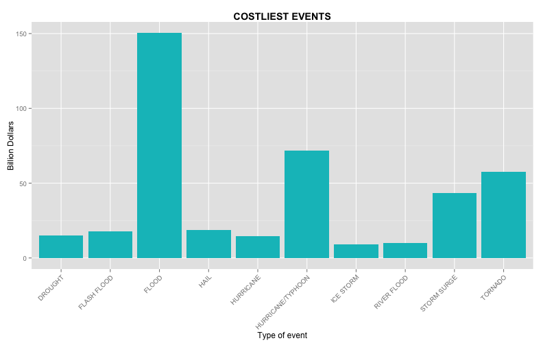

Public health and economic problems caused by Storms and other severe weather events 
====================================================================================

## Synopsis
This data analysis pretends address the following questions:   
* Across the United States, which types of events (as indicated in the EVTYPE variable) are most harmful with respect to population health?   
* Across the United States, which types of events have the greatest economic consequences?   

## Data Processing

Firstly, we load the needed libraries and unzip the file doing the needed checks.

```r
library(R.utils)
library(ggplot2)
library(plyr)
library(reshape2)

if (file.exists("repdata-data-StormData.csv.bz2") && 
        !file.exists("repdata-data-StormData.csv")) {
    bunzip2("repdata-data-StormData.csv.bz2")
}
```

Now, we load the data.

```r
storm.data <- read.csv("repdata-data-StormData.csv", stringsAsFactors=FALSE)

storm.data <- data.frame(as.Date(storm.data$BGN_DATE, "%m/%d/%Y %H:%M:%S"), 
                     storm.data$EVTYPE, 
                     storm.data$FATALITIES, 
                     storm.data$INJURIES,
                     storm.data$PROPDMG,
                     as.character(storm.data$PROPDMGEXP),
                     storm.data$CROPDMG,
                     as.character(storm.data$CROPDMGEXP),
                     storm.data$REFNUM)
colnames(storm.data) <- c("BGN_DATE", "EVTYPE", "FATALITIES", "INJURIES", 
                          "PROPDMG", "PROPDMGEXP", "CROPDMG", "CROPDMGEXP","REFNUM")
```

And, finally we calculate new numeric fields as PROPCASH (combines the PROPDMG 
and PROPDMGEXP fields to create a numeric value), CROPCASH (combines the CROPDMG 
and CROPDMGEXP fields to create a numeric value) and TOTCASH (combines the PROPCASH 
and CROPCASH fields to create a numeric value).

```r
# Do not use scientific notation
options(scipen=999)

# Mapping exponents
text.values <- c("h","H","k","K","m","M","b","B")
exp.values <- c(10^2,10^2,10^3,10^3,10^6,10^6,10^9,10^9)
map.exponents <- data.frame(text.values, exp.values)

#Calculating cash values
storm.data <- merge(map.exponents, storm.data, 
                    by.x="text.values", by.y="PROPDMGEXP", all.y=TRUE)
names(storm.data)[2] <- "prop.exponents"
storm.data$PROPCASH <- storm.data$PROPDMG * storm.data$prop.exponents
storm.data$PROPCASH[is.na(storm.data$PROPCASH)] <- 0

storm.data <- merge(map.exponents, storm.data[,2:11], 
                    by.x="text.values", by.y="CROPDMGEXP", all.y=TRUE)
names(storm.data)[2] <- "crop.exponents"
storm.data$CROPCASH <- storm.data$CROPDMG * storm.data$crop.exponents
storm.data$CROPCASH[is.na(storm.data$CROPCASH)] <- 0

storm.data$TOTCASH <- storm.data$PROPCASH + storm.data$CROPCASH

#cleaning data frame
storm.data <- storm.data[,c(4:7,10:13)]
```


## Results

## Most harmful types of events with respect to population health across the United States

Firstly, we summarize data about fatalities and injuries by type of event. And we create a total data frame.

```r
fatalities.total <- ddply(storm.data,.(EVTYPE),summarize,FATALITIES=sum(FATALITIES, na.rm=TRUE))
injuries.total <- ddply(storm.data,.(EVTYPE),summarize,INJURIES=sum(INJURIES, na.rm=TRUE))

total <- merge(fatalities.total, injuries.total, 
                    by.x="EVTYPE", by.y="EVTYPE", all=TRUE)
```

Now, as we need only the most harmful types of events, we take only those that are greater than 99th percentile. We reshape the data, and draw the graph.

```r
total <- total[total$FATALITIES > quantile(total$FATALITIES, probs=0.99) |
                    total$INJURIES > quantile(total$INJURIES, probs=0.99),]
    
summary <- melt(total, id=c("EVTYPE"), measure.vars=c("FATALITIES","INJURIES"))
```


```r
g <- ggplot(summary,
            aes(x=EVTYPE, 
                y=value))
g <- g + geom_bar(fill="#00BFC4", stat="identity")
g <- g + labs(x = "Type of event") 
g <- g + labs(y = "Number directly afected")
g <- g + labs(title="MOST HARMFUL EVENTS")
g <- g + facet_wrap( ~ variable, ncol=1)
g <- g + theme(plot.title = element_text(lineheight=.8, face="bold"),
               axis.text.x=element_text(angle=45,vjust=1,hjust=1))
print(g)
```

 

## Costliers types of events across the United States

Now, as we need only the costliers types of events, we take only those that are greater than 99th percentile.   

```r
economic.total <- ddply(storm.data,.(EVTYPE),summarize,TOTCASH=sum(TOTCASH, na.rm=TRUE))
    
g <- ggplot(economic.total[economic.total$TOTCASH > quantile(economic.total$TOTCASH, probs=0.99),],
            aes(x=EVTYPE, 
                y=TOTCASH/10^9))
g <- g + geom_bar(fill="#00BFC4", stat="identity")
g <- g + labs(x = "Type of event") 
g <- g + labs(y = "Billion Dollars")
g <- g + labs(title="COSTLIEST EVENTS")
g <- g + theme(plot.title = element_text(lineheight=.8, face="bold"),
               axis.text.x=element_text(angle=45,vjust=1,hjust=1))
print(g)
```

 
